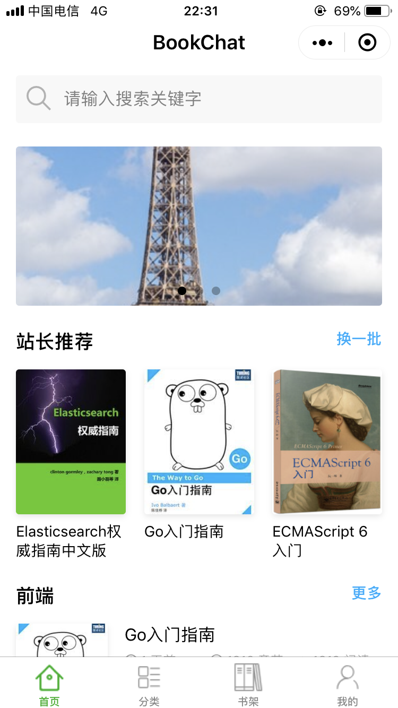
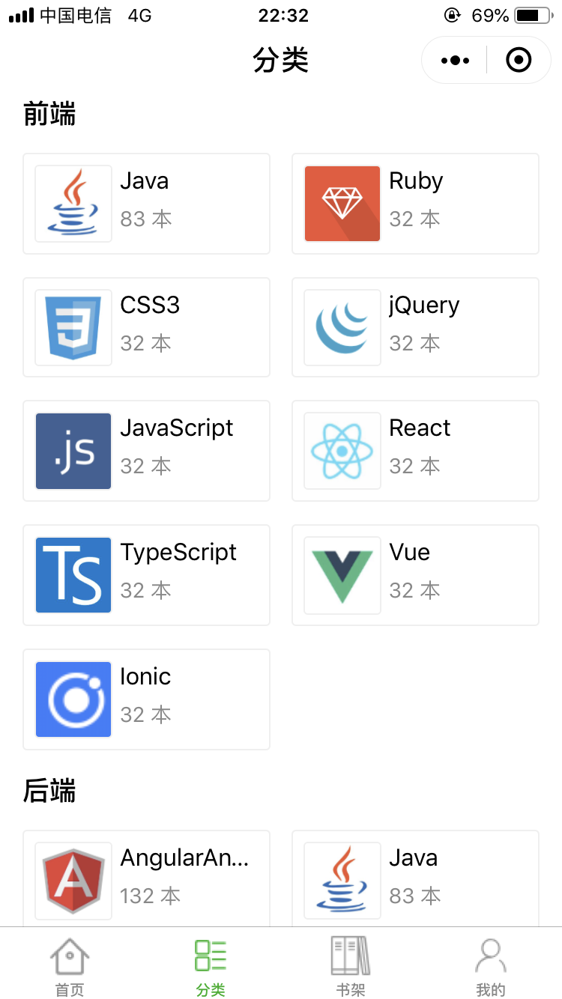
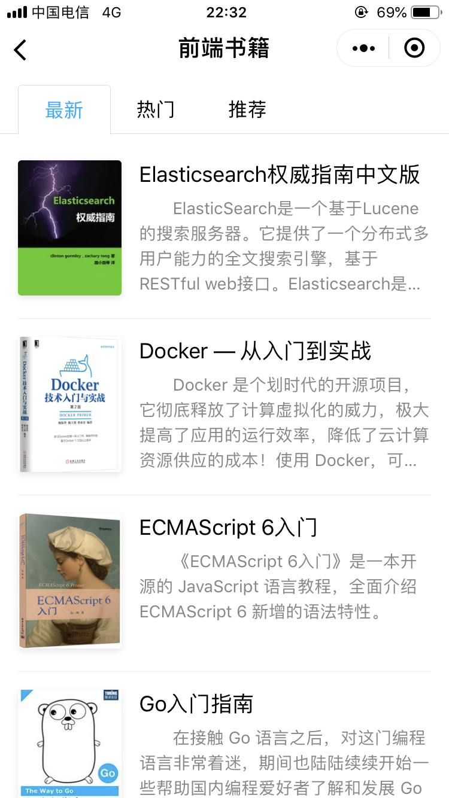
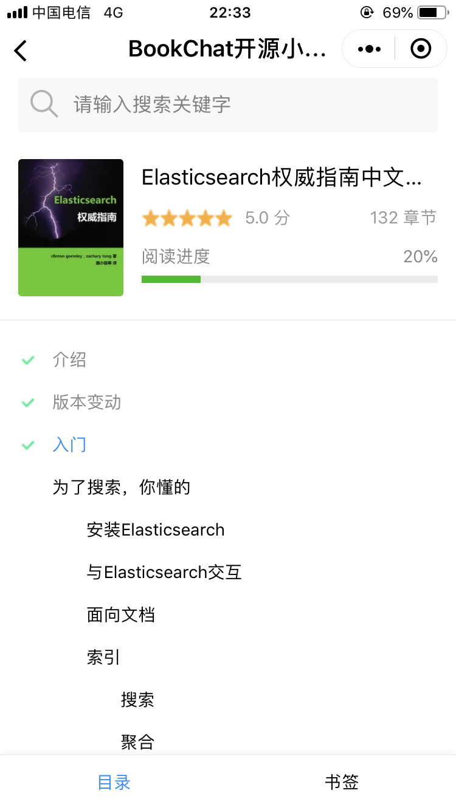
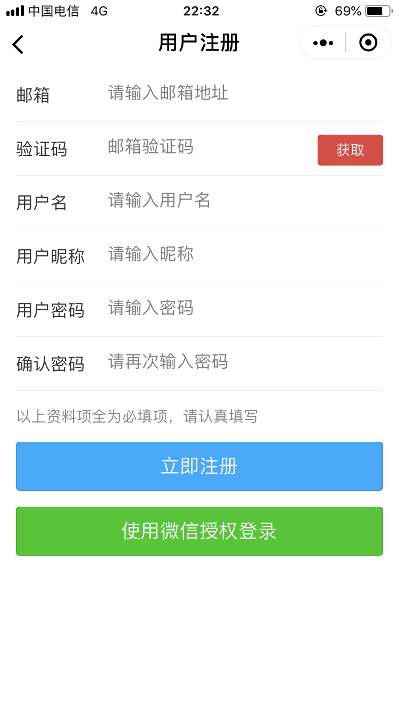
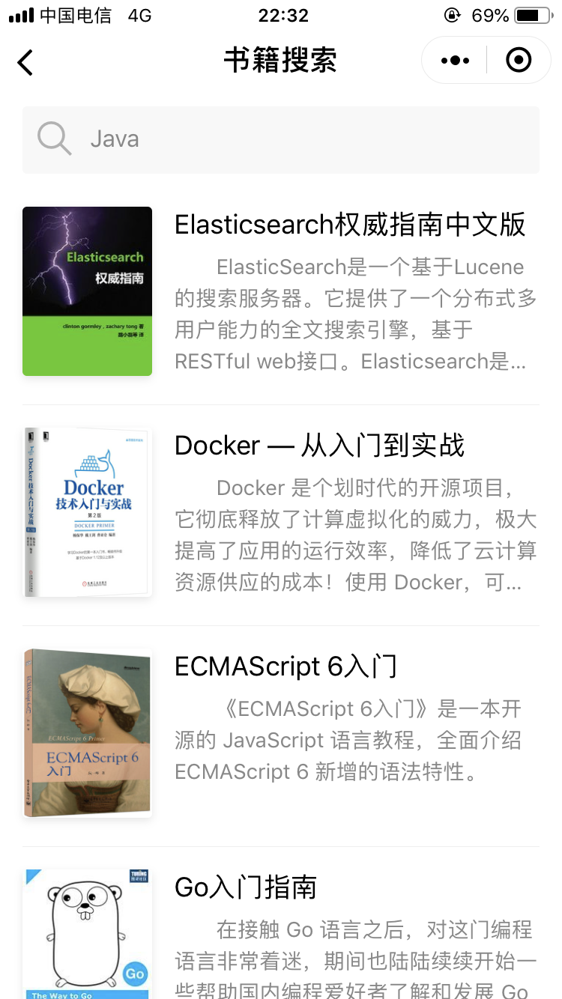

# BookChat - 通用的书籍阅读微信小程序

## 项目介绍

微信叫`WeChat`，所以我们叫`BookChat`.

`BookChat` - 基于 Apache 2.0 开源协议进行开源的通用书籍阅读微信小程序.


起初仅仅是想作为[BookStack](https://www.bookstack.cn)的配套小程序，但是后来想了一下，小说书籍和文档阅读类的小程序，不外乎也就是那些功能，所以把`BookChat`开发为通用的书籍阅读类小程序，以方便更多想要开发阅读类小程序的个人和企业。

小程序可能还有一些设计的不是很合理的地方，所以您在使用的过程中，遇到问题或者有更perfect的想法，请提交issues，让我们携手将小程序做的尽善尽美。

## 开发设计

小程序采用CSS3的`flex`实现的页面布局，文字大小和主题配色参照了腾讯官方的[微信小程序设计指南](https://developers.weixin.qq.com/miniprogram/design/index.html)。

由于没有人帮设计小图标，`BookChat`小程序中的各类小图标，基本上都是从[iconfont](http://iconfont.cn)找的，所以非常感谢热心的设计师们把自己精心设计的小图标分享出来.

小程序的源码，放在`src`目录下.

`BookChat`小程序，预计会迭代发布三个版本：

- [x] 第一个版本： 纯模板页面，实现页面间的链接跳转

- [ ] 第二个版本： 使用 [YAPI](https://github.com/YMFE/yapi) 约定所有API接口，请求动态数据

- [ ] 第三个版本： 套接`BookStack`的API接口，实现真正意义上的书籍阅读（届时会提前发布`BookStack` v2.x版本）

目前实现了第一个版本.

由于没有原型，小程序的功能和页面布局，主要借(抄)鉴(袭)了3个手机APP，所以，请允许我免费给他们打个小广告：

- [iReader](http://www.zhangyue.com/) - 引领品质阅读
- [微信读书](http://weread.qq.com/) - 让阅读不再孤独
- [熊猫阅读](http://www.pandadushu.com/) - (没有slogan就是最好的slogan...)

-------

好吧，他们都有一个响亮的Slogan，那么我们也要有一个：

> `BookChat` - 让阅读，成为一种本能

----------

**QQ交流群**

> 457803862（猿军团）

加群请备注`来自BookChat`

> 说明：该群是一个技术交流群。如果是开源程序遇到问题，请直接提交issues，群里不解答问题.

## 小程序体验

目前`BookChat`是第一个版本，只是一个模板小程序，实现了页面间的链接跳转。您可以在微信上通过关键字`BookChat`搜索并体验该小程序，或者直接扫描下方的二维码进行体验。

## 页面预览

### 首页

 
 
 

 
 
 
 
 
 

### 分类

 
 
 
 
 
 

### 分类书籍列表

 
 
 
 
 
 

### 书架

 
 
 
 
 
 

### 个人中心

### 书籍介绍

 
 
 

### 书籍目录

 
 
 

### 书籍阅读

 
 
 

### 注册、登录

 
 

 
 
 

### 书籍点评

 
 
 

### 书籍搜索结果

 
 
 

## 赞助

  如果您觉得`BookChat`帮助到了您，可以通过扫描下方二维码在您力所能及的范围内给我们小小的赞助，以支持和鼓励`BookChat`开源项目.

### 支付宝

### 微信
