[TOC]

# BookChat - 通用的书籍阅读微信小程序

## BookChat 介绍

微信叫`WeChat`，所以我们叫`BookChat`.

`BookChat` - 面向程序员的开源书籍和文档阅读学习小程序，同时也是一款基于 Apache 2.0 开源协议进行开源的通用书籍阅读微信小程序，助您轻松实现小说、电子书、各种文档手册和书籍的在线阅读。

## 停更说明

`BookChat` 微信小程序 v2.4 版本是微信小程序`原生开发`的最后一个版本，当前仓库以后不再进行更新。

因为已经用 `uni-app` 重新实现了一个更强大的`BookChat`，即`BookChatApp`，不但可以编译生成微信小程序，其他各平台的小程序都可以生成。

`BookChatApp` 开源地址：

- Gitee: https://gitee.com/truthhun/BookChatApp
- GitHub: https://github.com/truthhun/BookChatApp

`BookChatApp` 下载体验地址：

- https://www.bookstack.cn/app

`BookChatApp` 预览

## 后端程序

后端程序也是开源的：

- Gitee(码云): https://gitee.com/truthhun/BookStack
- Github: https://github.com/TruthHun/BookStack

**后端程序官网** 

书栈网：https://www.bookstack.cn

## 开发设计

`BookChat`采用CSS3的`flex`实现的页面布局，文字大小和主题配色参照了腾讯官方的[微信小程序设计指南](https://developers.weixin.qq.com/miniprogram/design/index.html)，小程序的图标来自热心的设计师们在[iconfont](http://iconfont.cn/)分享的小图标，HTML的渲染直接采用微信小程序自带的富文本组件`rich-text`实现。

## 功能特点

- 开源：基于 Apache 2.0 开源协议进行开源，对商业友好
- 秀气：简洁、美观，给您焕然一新的视觉体验，让你都不敢相信这是一个后端程序员设计和开发实现的
- 丰富：注册、登录、搜索、书架、书签、阅读偏好设置等功能齐全，麻雀虽小，五脏俱全
- 强大：微信官方小程序开发工具自带的`Audits`体验评分为`A`，性能和体验出色，给您原生APP的用户体验
- 小巧：没有引用任何第三方组件和UI，整个小程序，不使用zip打包压缩的情况下，大小不到 `200KB`，zip压缩后的大小只有`133KB`。
	
	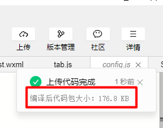
	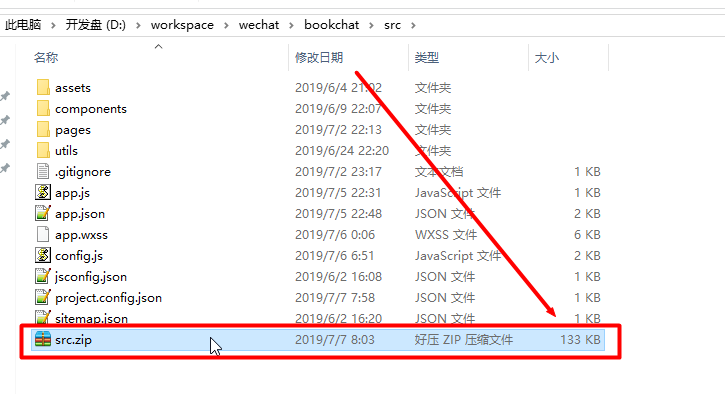

## 扫码体验

小程序好不好，当然要凭实力说话。

微信扫描下方小程序码，即可体验和感受下`BookChat`小程序：

希望，我们没有让你失望。

## 开源地址

- Gitee（码云）: https://gitee.com/truthhun/BookChat
- GitHub: https://github.com/truthhun/bookchat

**后端程序是BookStack**

- Gitee（码云）: https://gitee.com/truthhun/BookStack
- GitHub: https://github.com/truthhun/BookStack

`BookChat` 需要配套`BookStack` 2.0 以上版本使用。

## QQ交流群

QQ交流群：457803862（猿军团）

> 加群请备注`来自BookChat`

说明：
> 该群是一个技术交流群。如果是开源程序遇到问题，请直接提交issues，群里不解答问题.

## 联系作者

作者：皇虫（TruthHun）

- Email: `TruthHun#QQ.COM`（把 # 换成 @ ）
- QQ： `1272881215`
- 微信： `flying999999`

## 支持作者

`BookChat` 微信小程序是完全开源的，如果您觉得这个小程序很棒，可以通过以下两种方式支持作者：

1. 收藏`BookChat`微信小程序，分享和转发给身边的朋友，如果您认为值得分享。
1. 扫描下方支付宝和微信二维码，犒劳一下作者的`发际线`，助他早日“聪明`绝顶`”

	
	
	

## BookChat 照骗

### 首页

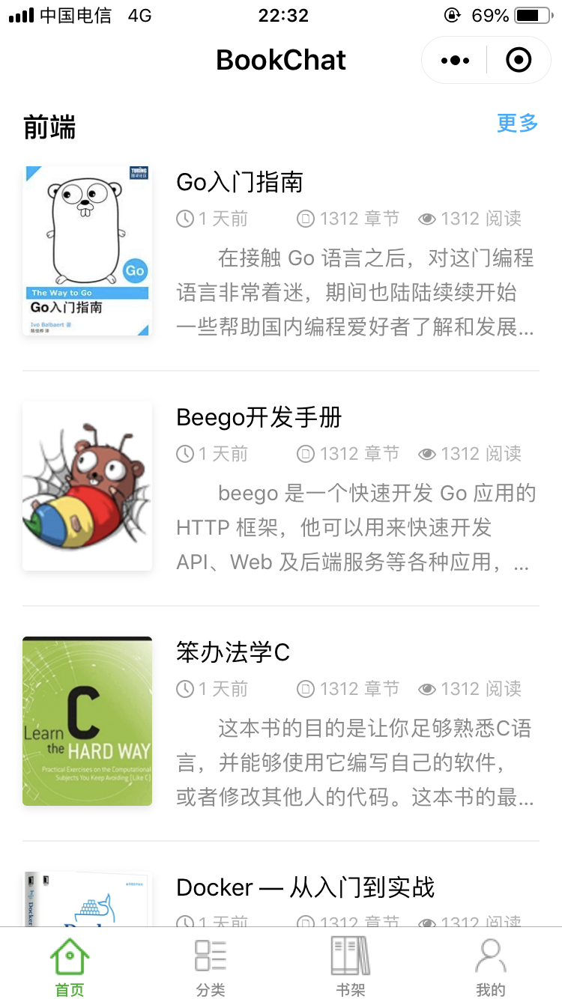

### 分类页

### 登录页

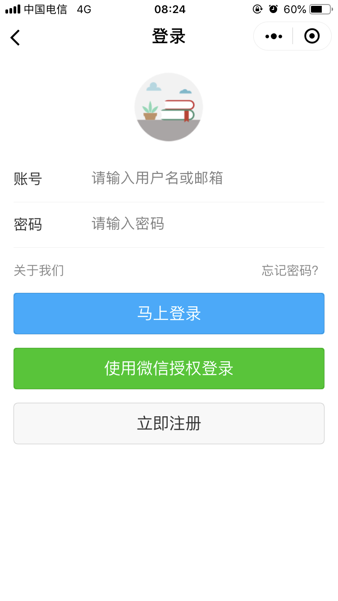

### 个人中心

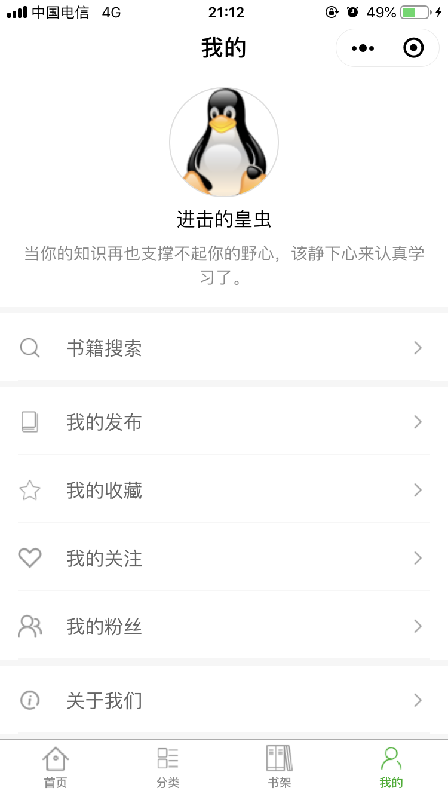

### 书架页

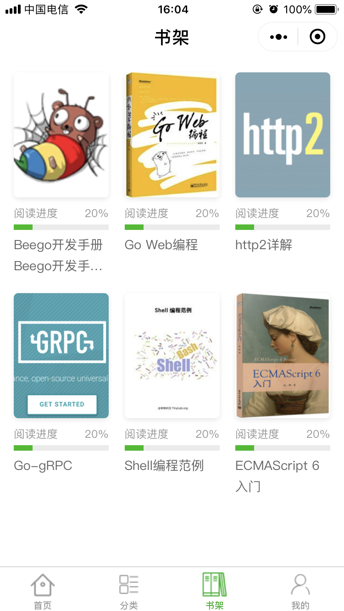

### 书籍页

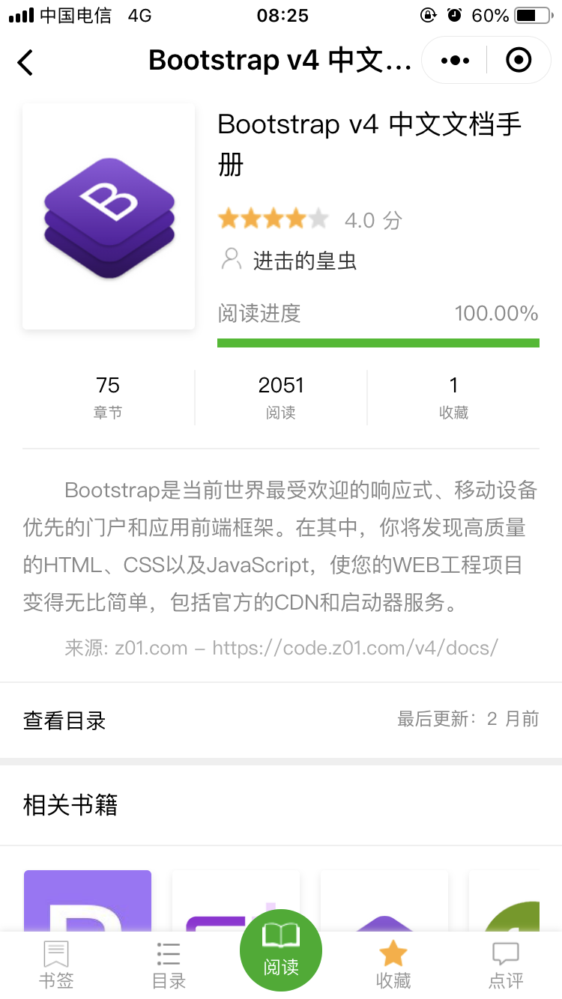

### 内容阅读

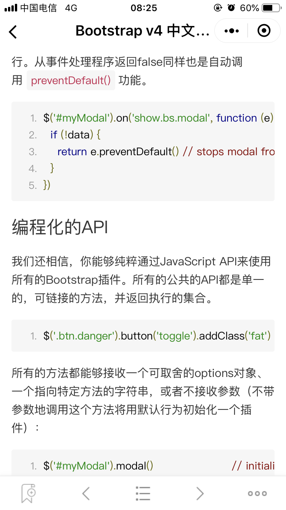

### 书籍目录

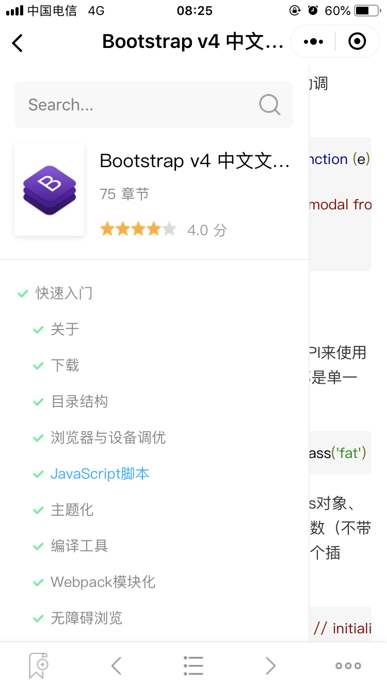

### 阅读偏好设置

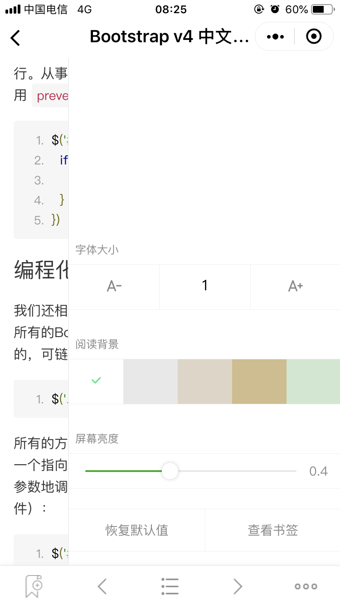

### 搜索结果页

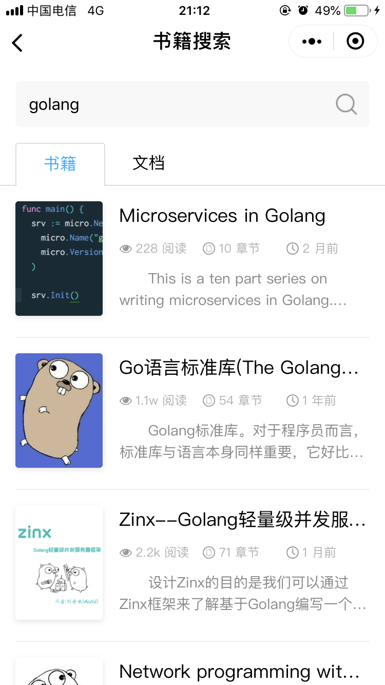

